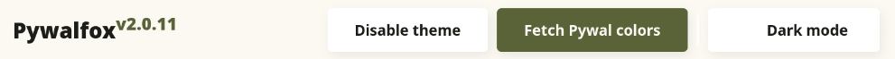
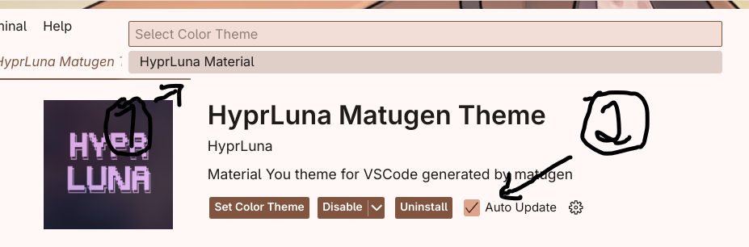

<div align="center">
<h1>-->🌕 Lumina Material Shell 🌕<--</h1>
</div>
<div align="center">
<a href="https://archlinux.org/">

</a>
<a href="https://github.com/crystalforceix/Lumina-Material-Shell">

</a>
<a href="https://github.com/Lunaris-Project/HyprLuna/commits/main">

</a>
</div>
<br/>
<div align="center">
<h1><strong>---- ✨Showcase of Lumina Material Shell✨ ----</strong></h1>
</div> 

https://github.com/user-attachments/assets/e3393a7c-7b15-4c2f-bfd7-259881ec2692
 <div align="center">

 <h2> --- 🏔️Fast Screenshot🏔️ --- </h2>

| Settings app | Widget |
|:---|:---------------|
|  |  |
| Colorscheme for GTK3/4 apps with Matugen | Powermenu Layout |
|  |  |

  <h1>--- 🗺️Instruction🗺️ ---</h1>
 </div>
 
 ### 📦Installation:
 <details>
 <summary>Step by step:</summary>
 
1. First, make sure you have some package before use the install script:
 
```
sudo pacman -S python python-pip git go
```
2. Secondly, git clone this repo then cd into directory:

```
cd ~ && git clone https://github.com/crystalforceix/Lumina-Material-Shell && cd Lumina-Material-Shell/Lumina-Material-Shell/
```
3. Thirdly, run script and let's following the script step by step according to your choice:

```
python3 install.py
```
4. Finally, after successfully installed shell let's reboot then enjoy btw:)

```
systemctl reboot
```
</details>

### 🚩Some questions and issues you may want to know:
<details>
<summary>Hey! I want colorscheme in firefox like your video showcase then how i can do it?</summary>
<br/>
 <strong>Follow my step:</strong>
  <br/>
  1. Install Pywalfox Extension from https://addons.mozilla.org/en-US/firefox/addon/pywalfox/
  <br/>
  2. Open the Pywalfox Extension then click on 'Fetch Pywalfox Color' 
  
<br/>
</details>
<details>
 <summary>Fonts are showing wrong color in firefox when in light mode (dark mode doesn't) with Pywalfox Extension then how to fix it?</summary>
 <br/>
 
 1. Check how it look like:

https://github.com/user-attachments/assets/17330ac5-da62-48a4-aa1f-0d8b7b21135b

 2. Here's how to fix it:

https://github.com/user-attachments/assets/9f15b873-cafb-49d5-9396-cc5c7e929954

</details>

<details>
 <summary>Ay wait? why my extension ("HyprLuna") extension in vscodium or code was installed but the colorscheme not working?</summary>
</br>
1. Make sure you have installed the ("HyprLuna") extension while installing Lumina-Material-Shell using scripts, if not:
 
- In this folder (https://github.com/crystalforceix/Lumina-Material-Shell/tree/mainline/Lumina-Material-Shell/Extensions/VSCodium) download the hyprluna.vsix package then use this command for install the extension:

```
vscodium --install-extension path-to-extension/hyprluna-theme-1.0.2.vsix # if you using Vscodium Editor
```
Or
```
code --install-extension path-to-extension/hyprluna-theme-1.0.2.vsix # if you using Code Editor
```
2. Now open your VSCodium/Code app then open extensions manager tab and and follow the order of the numbers below:



3. Done! and now try changing your wallpaper and see the result:)
</details>
<details>
 <summary>Alacritty app wont open whats going on?</summary>
 <br/>
 1. Make sure you have already installed newest AMDGPU and INTEL Graphics:
 
 - Instruction for AMDGPU: https://wiki.archlinux.org/title/AMDGPU
 - Instruction for Intel Graphics: https://wiki.archlinux.org/title/Intel_graphics
 
 2. If it's doen't work try remove lumina-alacritty-smooth-cursor package:
   ```
   sudo pacman -R lumina-alacritty-smooth-cursor
   ```
 3. Then install normal alacritty package:
   ```
   sudo pacman -Sy alacritty
   ```
 4. If you use regular alacritty instead of lumina-alacritty-smooth-cursor then do this to avoid the errors:
 - Go to alacritty's configuration directory and modify alacritty.toml:
  
  ```
cd ~/.config/alacritty/
  ```
 - Remove there lines in alacritty.toml:
  ```
[cursor]
# Set to false to disable completely
smooth_motion = true
# 0.0 = cursor is not moving, 1.0 = cursor moves instantly
smooth_motion_factor = 0.5
# 0.0 = broken, 1.0 = cursor shape is unaffected by movement
smooth_motion_spring = 0.5
# Limits how the cursor size may change
smooth_motion_max_stretch_x = 3.0
smooth_motion_max_stretch_y = 3.0
# Override "block" cursor if you don't like how it looks in this fork
# I prefer "underline"
block_replace_shape = "underline"
  ```
> [!Trick]
> 
> If you are using Gen 7 and older hardware Intel chipset then try uninstall mesa driver and install mesa-amber driver, somehow it will work.
> 
> Idk which AMD chipset will going to work:( maybe you should using the regular alacritty app btw.
</details>

#
### ❤️Credits:
- Thanks to [Exo Shell](https://github.com/debuggyo/Exo) Since almost all components in this shell were written by them, you can think of this as just a fork of the Exo repo :)
Also, don’t forget to give the Exo repo a ⭐!
- Special thanks to @debuggyo (https://github.com/debuggyo) For his interesting stuff and programming style in python and ignis shell!
- The audio and wallpaper used in the video showcase were created by [NyaChan!](https://www.youtube.com/@NyaChan-channel) and also many thanks to her/him for an awesome song!
- Thanks to [Niri](https://github.com/YaLTeR/niri) For an awesome Scrollable-tiling Wayland compositor!
- Thanks to [HyprLuna](https://github.com/Lunaris-Project/HyprLuna) For awesome colorscheme extension in VSC and their other things that's really useful!
